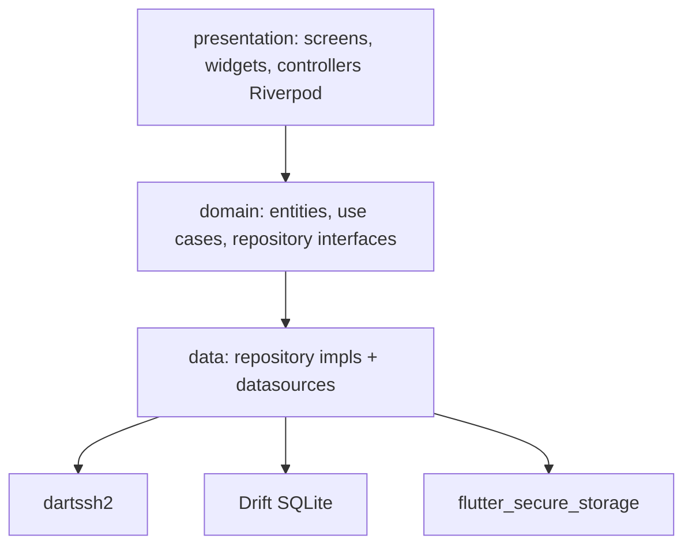

# Arquitectura — AgentWrapper

> Clean Architecture pragmática + organización feature-first. Único objetivo: que añadir/modificar una feature toque pocos archivos y nada de plomería.

## Visión por capas



**Regla dura**: las flechas no se invierten. La UI nunca importa `dartssh2` ni Drift; los adapters de agentes hablan con `SshSession` (interfaz), no con `SSHClient`.

## Organización feature-first

Cada feature es una mini-aplicación con sus tres capas:

```text
features/<feature>/
  domain/        # entidades + interfaces + use cases
  data/          # impls + datasources concretos
  presentation/  # widgets + Riverpod providers
```

`core/` y `services/` son transversales: tema, router, DI, base de datos, SSH, secure storage.

## Estado y DI

- **Riverpod 2**. Cada feature expone providers en su `presentation/`.
- Providers globales (DB, SSH, secure storage, registry de agentes) viven en `core/di/providers.dart`.
- En `main.dart` se sobrescriben los providers que requieren inicialización asíncrona (apertura de la DB, etc.) usando `ProviderScope.overrides`.

## Navegación

- **go_router** con rutas tipadas como constantes en `core/router/app_router.dart`.
- Sub-rutas (`/connections/:hostId/install`) reflejan jerarquía de features.
- Deep links listos para futuros callbacks OAuth de instalación.

## Errores

- `Failure` (sealed) para retornos de repositorio.
- `AppException` para cruzar boundaries asíncronos sin perder tipo.
- La UI traduce `Failure` a strings; no hay strings de UI en data/domain.

## Concurrencia y streams

- SSH y agentes son **stream-first**: tanto outputs en vivo (instalación, REPL) como eventos estructurados (`AgentEvent`).
- Riverpod `StreamProvider`/`AsyncNotifier` cubre la mayoría de casos; usar controladores propios solo cuando se necesita backpressure fino (terminal).

## Testabilidad

- Toda dependencia exterior (SSH, DB, almacenamiento) entra por interfaz.
- Tests unitarios con `mocktail`. Tests de widget con `flutter_test`. Integración con `integration_test`.
- Goldens para componentes del design system (TODO).

## Trade-offs explícitos

- Elegimos **Drift** sobre Hive porque modelamos relaciones (host → projects → sessions → messages). Cuesta algo más de boilerplate; lo asumimos.
- Elegimos **dartssh2** sobre wrappers nativos para tener una sola implementación entre Android/iOS y poder testear en host de desarrollo.
- No usamos freezed por defecto en este bootstrap para que el proyecto compile sin codegen; añadirlo es trivial cuando se ejecute `build_runner` por primera vez.
