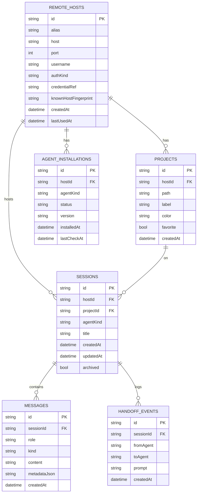

# Modelo de datos local

Persistencia local con **Drift** (SQLite tipado). Los datos sensibles (passwords, claves privadas, tokens OAuth) **no** se almacenan aquí; se guardan en `flutter_secure_storage` y la base de datos sólo conserva una referencia opaca (`credentialRef`).

## Tablas



## Decisiones

- `id` como **TEXT (UUID v4)** en todas las tablas para permitir generación offline y eventual sincronización futura.
- `messages.kind` es un string libre con valores conocidos (`text`, `code`, `diff`, `log`, `terminal`, `handoff`) para evitar migraciones cuando aparezcan tipos nuevos. Los renderers desconocidos hacen fallback a texto plano.
- `metadataJson` es un campo de escape por mensaje (lenguaje del code block, path del diff, level del log, …). Mantiene el esquema estable cuando cambian las heurísticas.
- `handoff_events.prompt` se guarda **completo** para auditoría: nos permite reconstruir el contexto que recibió cada modelo.

## Migraciones

El campo `schemaVersion` empieza en `1`. Toda subida añade una `await m.alterTable(...)` o crea nuevas tablas en `onUpgrade`. Política: nunca borrar columnas de golpe — añadir columna nueva, migrar datos, deprecar.

## Secretos: convención de `credentialRef`

`credentialRef` es un UUID v4. En `flutter_secure_storage` guardamos un JSON:

```json
{
  "kind": "password" | "privateKey",
  "value": "...",
  "passphrase": "..."   // sólo si privateKey la requiere
}
```

Borrar un host implica un `delete` en la DB **y** un `wipeAll` selectivo del `credentialRef` correspondiente.
