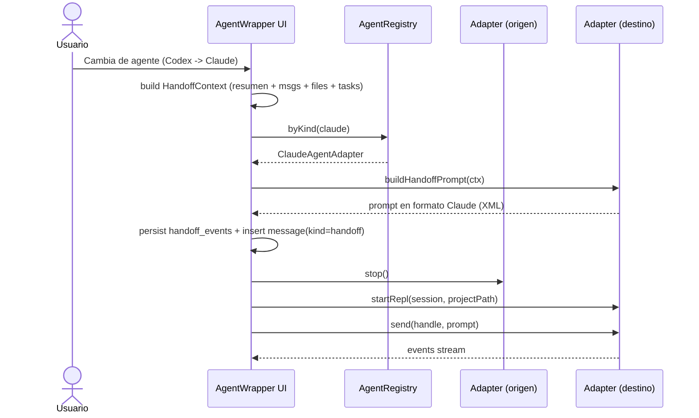

# Sistema de handoff entre agentes

Cuando el usuario cambia de agente dentro de una sesión, la conversación visible **no se reinicia**: la "conversación canónica" vive en la app, y se le envía al nuevo agente un prompt de **handoff** que resume el contexto.

## Principios

- **El destino decide el formato.** Cada modelo responde mejor a su framing preferido (XML tags para Claude, markdown estructurado para Codex, bloques `[CONTEXT_HANDOFF]` para Cursor).
- **El emisor aporta solo datos**: resumen, mensajes recientes, archivos abiertos, tareas pendientes (`HandoffContext`).
- **El usuario ve el handoff**: se inserta como un `message` con `kind = 'handoff'` para que la UI lo pinte explícitamente. La transparencia importa.
- **El handoff es persistente**: se guarda en `handoff_events` para auditoría y para poder "rehidratar" la sesión más tarde.

## Flujo

## `HandoffContext` mínimo recomendado

| Campo | Origen | Notas |
|-------|--------|-------|
| `summary` | el adapter origen lo calcula al cierre del turno | 1-3 párrafos |
| `recentMessages` | últimas N (10-20) entradas de `messages` | excluir bloques largos de código |
| `openFiles` | inferido por `block_parser` (paths que aparecen en diffs/code blocks) | top-10 |
| `pendingTasks` | TODOs detectados en outputs del agente origen | regex sobre `TODO:`/`- [ ]` |
| `projectPath` | `sessions.project_id -> projects.path` | imprescindible para reabrir el REPL |

## Trade-off

Resumir el contexto **comprime** la conversación; perdemos detalle. Aceptable porque la conversación canónica sigue completa en la app y siempre podemos reenviar trozos textuales si el usuario los pega o los referencia. La alternativa (volcar toda la historia) explota el contexto del modelo destino y es peor.

## Futuro

- **Token budgeting**: estimar tokens del prompt y truncar `recentMessages` por antigüedad.
- **Resumen incremental**: que cada agente actualice un summary persistente al final de su turno, evitando recalcularlo al cambiar.
- **Handoffs parciales**: permitir handoff sólo de un sub-tema marcado por el usuario.
